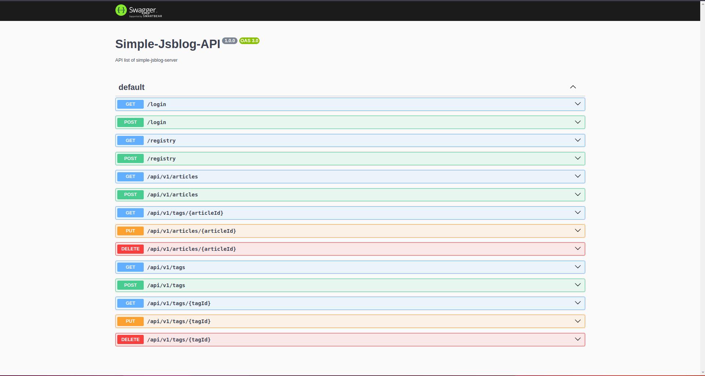

# simple-jsblog-server

This is a simple practice project of blog backend written in JavaScript with features below:
- Custom logger service to show app log according to the logging level
- Blog features implement
- Unit test of all API endpoints

## Features

### About USER

- User registry
- User login and return jwt token

### About TAG of blog article

- List all tags
- List specific tag details
- Create a new tag
- Update tag details
- Delete a tag

### About ARTICLE of blog

- List all articles (include article's tag)
- List specific article details (include article's tag)
- Create a new article
- Update article details
- Delete a article

> [!NOTE]
> You can run up the app and browse the all APIs detail via http://localhost:3000/api/docs
> 
